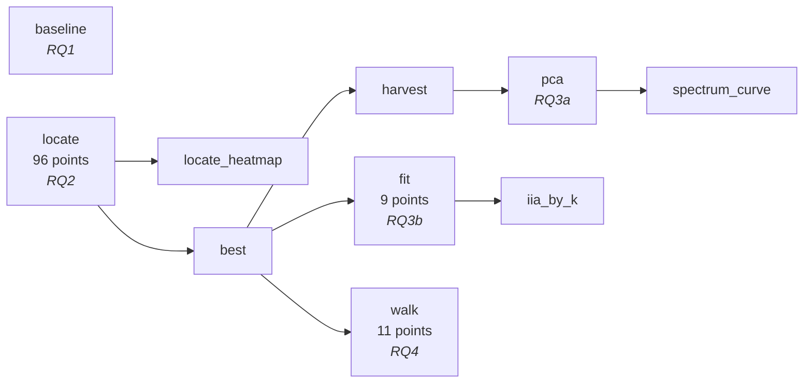
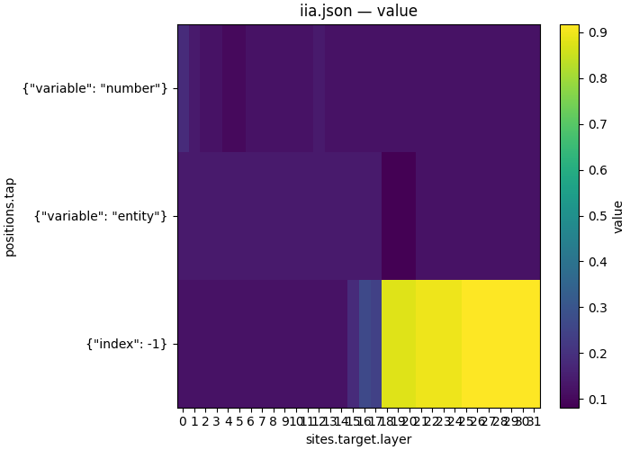
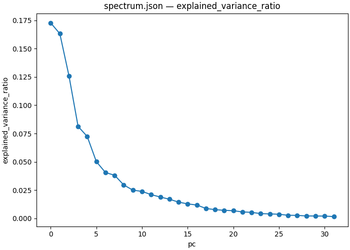
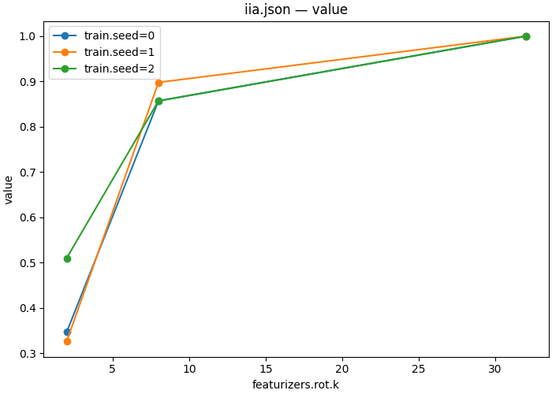

# Weekdays geometry — four questions about one variable

| | |
|---|---|
| **Question** | Where and how does the model represent the weekday it is about to answer — and what does it say from the points in between two answers? |
| **Method** | a workflow: baseline → interchange scan → PCA and DAS at the located cell → an interpolation walk |
| **Model** | `meta-llama/Llama-3.1-8B` @ `main`, bf16 |
| **Data** | `weekdays/data` — one undivided 49-row pool, `split: "all"`: every prompt of the 7 entity × 7 number space exactly once, `natural_domains_arithmetic`, `domain_type=weekdays`; built as a split table (task `natural_domains_arithmetic`, `--set domain_type=weekdays`, seed 0, fraction `all=1.0`, target variable `result`, written to `demos/weekdays_geometry/data/weekdays/data.json`) |
| **Documents** | [`workflows/weekdays_geometry.json`](workflows/weekdays_geometry.json) → five [`protocols/`](protocols/) |
| **Cost** | 10 steps, 118 points over 49 rows; the DAS step trains 9 rotations. ~110 s on one H100 80GB |
| **Reproduced** | ⚠ five of the eight figures are carried from the pre-refactor reference run and have no producer in the workflow |

## TL;DR

The task is weekday arithmetic — *"What day is four days after Sunday?"* — and
the variable is the answer day. Llama-3.1-8B solves it (**0.9184**, 45 of the 49
prompts in the space, against a 1-in-7 floor of 0.143), and an interchange scan
puts the answer at the last token from **L18** on, sharply: the null level
exactly for fifteen layers, 0.245 at L17, **0.878 at L18**, a 0.9184 plateau
from **L25** — which is 45/49, the same *count* the model gets right unaided but
a different 45 rows, because the interchange succeeds exactly when the model
answers the **counterfactual** prompt correctly, making it demonstrably pure
routing. The representation there is not one
direction: seven principal components carry 70% of the variance, two directions
reach only 0.395 against the whole-cell interchange's 0.9184, eight reach 0.871
and thirty-two exceed it — though a 4096 × k rotation fitted to
49 pairs is too underdetermined to call that a bound on causal dimensionality.
Walking the residual stream in a straight line between two answers passes
*through* a third weekday on 17 of the 43 rows whose endpoints differ, and the
pattern is the geometry: **never** on the 10 adjacent pairs, **14 of 22** at
distance two (12 of them through the unique day between), but only **3 of 11** at
distance three — so the chord tracks the ring locally and cuts across it at range.

## The protocol

A workflow demo: the thesis is the chain. It is inlined here in full, and its
five step documents follow it, folded, under
[*The step documents, verbatim*](#the-step-documents-verbatim) — so that the
chain stays the thing this section reads as.

[`workflows/weekdays_geometry.json`](workflows/weekdays_geometry.json), inlined
verbatim — the file is what `causalab run` reads, and
`tests/demos/test_demos.py` checks these bytes against it.

```json
{
  "version": "1",
  "description": "The weekdays_geometry demo end to end: check the model can do the task, locate the cell that carries the answer, ask how few directions in that cell suffice, and walk the straight line between two answers. Nothing here declares an order -- every edge is a reference to an earlier step's output, and the runner derives the rest.",
  "output_dir": "weekdays_geometry",
  "steps": {
    "baseline": {"type": "intervention_protocol", "document": "../protocols/weekdays_baseline.json"},
    "locate": {
      "type": "intervention_protocol",
      "document": "../protocols/weekdays_locate_scan.json"
    },
    "locate_heatmap": {
      "type": "script",
      "script": {"module": "causalab.io.plots.workflow_figures"},
      "inputs": {
        "table": {"step": "locate", "file": "iia.json"},
        "plot": "heatmap",
        "x": "sites.target.layers",
        "y": "positions.tap"
      },
      "outputs": {"figure": "locate_iia.png", "plotted": {"file": "locate_iia.json"}}
    },
    "best": {
      "type": "script",
      "script": {"module": "causalab.workflow.scripts.select"},
      "inputs": {
        "table": {"step": "locate", "file": "iia.json"},
        "choose": "max",
        "emit": {"best_layer": "sites.target.layers", "best_pos": "positions.tap"}
      },
      "outputs": {
        "values": {
          "file": "values.json",
          "keys": {"best_layer": 25, "best_pos": {"index": -1}}
        }
      }
    },
    "harvest": {
      "type": "intervention_protocol",
      "document": "../protocols/weekdays_harvest.json",
      "set": {
        "sites.target.layers": {"artifact": "best", "key": "best_layer"},
        "positions.best": {"artifact": "best", "key": "best_pos"}
      }
    },
    "pca": {
      "type": "script",
      "script": {"module": "causalab.analysis.fit_pca"},
      "inputs": {"acts": {"step": "harvest", "file": "acts.safetensors"}, "k": 32},
      "outputs": {
        "weight": "basis.safetensors",
        "spectrum": {
          "file": "spectrum.json",
          "columns": {
            "pc": "int64",
            "explained_variance": "float64",
            "explained_variance_ratio": "float64"
          }
        }
      }
    },
    "spectrum_curve": {
      "type": "script",
      "script": {"module": "causalab.io.plots.workflow_figures"},
      "inputs": {
        "table": {"step": "pca", "file": "spectrum.json"},
        "plot": "lines",
        "x": "pc",
        "value": "explained_variance_ratio"
      },
      "outputs": {"figure": "pca_spectrum.png"}
    },
    "fit": {
      "type": "intervention_protocol",
      "document": "../protocols/weekdays_das_sweep.json",
      "set": {
        "sites.target.layers": {"artifact": "best", "key": "best_layer"},
        "positions.best": {"artifact": "best", "key": "best_pos"}
      }
    },
    "iia_by_k": {
      "type": "script",
      "script": {"module": "causalab.io.plots.workflow_figures"},
      "inputs": {
        "table": {"step": "fit", "file": "iia.json"},
        "plot": "lines",
        "x": "featurizers.rot.k",
        "series": "train.seed"
      },
      "outputs": {"figure": "iia_by_k.png", "plotted": {"file": "iia_by_k.json"}}
    },
    "walk": {
      "type": "intervention_protocol",
      "document": "../protocols/weekdays_linear_walk.json",
      "set": {
        "sites.target.layers": {"artifact": "best", "key": "best_layer"},
        "positions.best": {"artifact": "best", "key": "best_pos"}
      }
    }
  }
}
```

The derived schedule — five levels, none of them authored:



`baseline` and `locate` share level 0 because neither references the other.
Everything downstream of `best` waits on it — not because the document says so,
but because three `set` blocks name it.

| step | document | what it contributes |
|---|---|---|
| `baseline` | [`weekdays_baseline.json`](protocols/weekdays_baseline.json) | one un-intervened forward per row; `match` accuracy. No `writes`, therefore no `intervened_models` |
| `locate` | [`weekdays_locate_scan.json`](protocols/weekdays_locate_scan.json) | 32 layers × 3 positions of interchange, scored by IIA |
| `best` | `causalab.workflow.scripts.select` | groups the metric table by the producing document's sweep coordinates — read from the step's `_step.json`, not authored — and emits the argmax cell |
| `harvest` | [`weekdays_harvest.json`](protocols/weekdays_harvest.json) | pure reads at that cell. No `reduce`: a mean has no variance to decompose |
| `fit` | [`weekdays_das_sweep.json`](protocols/weekdays_das_sweep.json) | trains a rotation and interchanges only its first *k* coordinates, over k × seed |
| `walk` | [`weekdays_linear_walk.json`](protocols/weekdays_linear_walk.json) | `lerp` from base activation to counterfactual activation, α in 11 steps |

The handoff worth reading twice is `best` → `fit`. `select` emits
`best_layer` and `best_pos` into `values.json`; `fit`'s `set` block re-points
the DAS document's site and position at them. The DAS document is therefore
*not* pinned to a layer — the scan chooses it, and if the scan chooses
differently the fit follows, with no edit anywhere.

### The step documents, verbatim

The table above links each of these; this is what they say. Every block is the
file byte for byte — the file is what `causalab run` reads, and
`tests/demos/test_demos.py` fails if a copy here stops matching it.

<details>
<summary><code>baseline</code> · <code>protocols/weekdays_baseline.json</code> — one un-intervened forward per row (22 lines)</summary>

```json
{
  "header": {
    "protocol_version": "3",
    "description": "RQ1 -- can the model solve the task at all? No writes, so no intervened models: one un-intervened forward per row, scored against the row's own answer. A localization result on a task the model cannot do is a measurement of noise, so this document runs first and gates the rest."
  },
  "model": {"key": "meta-llama/Llama-3.1-8B", "revision": "main", "dtype": "bf16"},
  "data": {"base": {"dataset": "weekdays/data", "field": "input"}},
  "method": {
    "sites": {"lm_head": {"component": "lm_head"}},
    "reads": {"logits": {"site": "lm_head", "pos": -1, "model": "original", "input": "base"}},
    "metrics": {
      "accuracy": {
        "kind": "match",
        "of": "logits",
        "expected": "base_answer_forms",
        "mode": "first_token",
        "token_form": "space_prefixed"
      },
      "said": {"kind": "top_k", "of": "logits", "k": 3, "by": "prob"}
    },
    "save": [
      {
        "value": "accuracy",
        "model": "original",
        "input": "base",
        "file_path": "accuracy.json"
      },
      {"value": "said", "model": "original", "input": "base", "file_path": "said.json"}
    ]
  }
}
```

</details>

<details>
<summary><code>locate</code> · <code>protocols/weekdays_locate_scan.json</code> — 32 layers × 3 positions, scored by IIA (111 lines)</summary>

```json
{
  "header": {
    "protocol_version": "3",
    "description": "RQ2 -- which position carries the result? Interchange the residual stream at a 32-layer x 3-position grid and score IIA. The task's generator samples the counterfactual independently, so entity AND number differ between the two prompts: each input token therefore carries half of what determines the answer, and only the answer slot can carry the whole result. The entity and number columns are the control -- a scan that lights them up is reading something other than the result."
  },
  "model": {"key": "meta-llama/Llama-3.1-8B", "revision": "main", "dtype": "bf16"},
  "data": {
    "base": {"dataset": "weekdays/data", "field": "input"},
    "counterfactual": {"dataset": "weekdays/data", "field": "counterfactual_inputs[0]"}
  },
  "method": {
    "positions": {
      "tap": {
        "sweep": [{"variable": "entity"}, {"variable": "number"}, {"index": -1}]
      }
    },
    "sites": {
      "target": {
        "component": "block_output",
        "layers": {
          "sweep": {"range": [0, 32]}
        }
      },
      "lm_head": {"component": "lm_head"}
    },
    "reads": {
      "v_cf": {"site": "target", "pos": "tap", "model": "original", "input": "counterfactual"},
      "logits": {"site": "lm_head", "pos": -1, "model": "patched", "input": "base"}
    },
    "writes": {
      "patch": {"site": "target", "pos": "tap", "do": {"swap": "v_cf"}}
    },
    "intervened_models": {
      "patched": {"input": "base", "writes": ["patch"]}
    },
    "metrics": {
      "iia": {
        "kind": "match",
        "of": "logits",
        "expected": "label_forms",
        "mode": "first_token",
        "token_form": "space_prefixed"
      },
      "logit_diff": {
        "kind": "logit_diff",
        "of": "logits",
        "a": "cf_answer",
        "b": "base_answer",
        "token_form": "space_prefixed"
      }
    },
    "save": [
      {"value": "iia", "model": "patched", "input": "base", "file_path": "iia.json"},
      {
        "value": "logit_diff",
        "model": "patched",
        "input": "base",
        "file_path": "logit_diff.json"
      }
    ]
  }
}
```

</details>

<details>
<summary><code>harvest</code> · <code>protocols/weekdays_harvest.json</code> — pure reads at the located cell (42 lines)</summary>

```json
{
  "header": {
    "protocol_version": "3",
    "description": "RQ3a -- the activations a principal basis is fitted to. Pure reads at the located cell: one un-intervened forward per row, one row per activation. No `reduce`, because a mean has no variance to decompose."
  },
  "model": {"key": "meta-llama/Llama-3.1-8B", "revision": "main", "dtype": "bf16"},
  "data": {"base": {"dataset": "weekdays/data", "field": "input"}},
  "method": {
    "positions": {"best": {"index": -1}},
    "sites": {
      "target": {"component": "block_output", "layers": [18]}
    },
    "reads": {"acts": {"site": "target", "pos": "best", "model": "original", "input": "base"}},
    "save": [
      {
        "value": "acts",
        "model": "original",
        "input": "base",
        "file_path": "acts.safetensors"
      }
    ]
  }
}
```

</details>

<details>
<summary><code>fit</code> · <code>protocols/weekdays_das_sweep.json</code> — a trained rotation, over k × seed (47 lines)</summary>

```json
{
  "header": {
    "protocol_version": "3",
    "description": "RQ3b -- how few directions carry the variable? Train an orthogonal rotation at the located cell and interchange only its first k coordinates, over k x seed = 9 fits from one harvest. The k axis is the question. What it measures is CAPACITY, not dimensionality: with 4096*k - k(k+1)/2 parameters fitted to 49 pairs the fit is underdetermined by orders of magnitude, and a large-k rotation reaches rows the model itself answers wrongly -- so a k whose IIA matches the whole-cell interchange bounds nothing about the variable. Read the curve as how much answer a k-subspace can supply at a matched budget."
  },
  "model": {"key": "meta-llama/Llama-3.1-8B", "revision": "main", "dtype": "bf16"},
  "data": {
    "base": {"dataset": "weekdays/data", "field": "input"},
    "counterfactual": {"dataset": "weekdays/data", "field": "counterfactual_inputs[0]"}
  },
  "method": {
    "positions": {"best": {"index": -1}},
    "sites": {
      "target": {"component": "block_output", "layers": [18]},
      "lm_head": {"component": "lm_head"}
    },
    "featurizers": {
      "rot": {
        "kind": "subspace",
        "k": {"sweep": [2, 8, 32]},
        "parametrization": "cayley"
      }
    },
    "reads": {
      "v_cf": {
        "site": "target",
        "pos": "best",
        "model": "original",
        "input": "counterfactual",
        "featurizer": "rot"
      },
      "logits": {"site": "lm_head", "pos": -1, "model": "patched", "input": "base"}
    },
    "writes": {
      "patch": {"site": "target", "pos": "best", "featurizer": "rot", "do": {"swap": "v_cf"}}
    },
    "intervened_models": {
      "patched": {"input": "base", "writes": ["patch"]}
    },
    "metrics": {
      "iia": {
        "kind": "match",
        "of": "logits",
        "expected": "label_forms",
        "mode": "first_token",
        "token_form": "space_prefixed"
      },
      "ce": {
        "kind": "cross_entropy",
        "of": "logits",
        "target": "label",
        "token_form": "space_prefixed"
      }
    },
    "train": {
      "objective": [[1.0, "ce"]],
      "params": ["rot"],
      "optimizer": {"name": "adamw", "lr": 0.001, "weight_decay": 0.0},
      "steps": {"epochs": 10},
      "batch": {"pairs": 16},
      "precision": {"feature": "fp32", "loss": "fp32"},
      "seed": {"sweep": [0, 1, 2]}
    },
    "save": [
      {"value": "iia", "model": "patched", "input": "base", "file_path": "iia.json"},
      {"value": "ce", "model": "patched", "input": "base", "file_path": "ce.json"},
      {"value": "rot", "site": "target", "file_path": "rot.safetensors"}
    ]
  }
}
```

</details>

<details>
<summary><code>walk</code> · <code>protocols/weekdays_linear_walk.json</code> — <code>lerp</code> from base to counterfactual, α in 11 steps (119 lines)</summary>

```json
{
  "header": {
    "protocol_version": "3",
    "description": "RQ4 -- what does the model say from the points between two answers? Interpolate the located cell's activation from the base row's value to the counterfactual row's, alpha in 11 steps, and read the probability mass on each of the seven weekday tokens. alpha=0 is the un-intervened model and alpha=1 is the full interchange of RQ2, so the two endpoints are results this demo already has: the sweep is the straight line between them."
  },
  "model": {"key": "meta-llama/Llama-3.1-8B", "revision": "main", "dtype": "bf16"},
  "data": {
    "base": {"dataset": "weekdays/data", "field": "input"},
    "counterfactual": {"dataset": "weekdays/data", "field": "counterfactual_inputs[0]"}
  },
  "method": {
    "positions": {"best": {"index": -1}},
    "sites": {
      "target": {"component": "block_output", "layers": [18]},
      "lm_head": {"component": "lm_head"}
    },
    "reads": {
      "v_cf": {"site": "target", "pos": "best", "model": "original", "input": "counterfactual"},
      "logits": {"site": "lm_head", "pos": -1, "model": "walked", "input": "base"}
    },
    "writes": {
      "walk": {
        "site": "target",
        "pos": "best",
        "do": {
          "lerp": {
            "op": "v_cf",
            "alpha": {"sweep": [0.0, 0.1, 0.2, 0.3, 0.4, 0.5, 0.6, 0.7, 0.8, 0.9, 1.0]}
          }
        }
      }
    },
    "intervened_models": {
      "walked": {"input": "base", "writes": ["walk"]}
    },
    "metrics": {
      "day_probs": {
        "kind": "class_probs",
        "of": "logits",
        "groups": {
          "Monday": ["Monday"],
          "Tuesday": ["Tuesday"],
          "Wednesday": ["Wednesday"],
          "Thursday": ["Thursday"],
          "Friday": ["Friday"],
          "Saturday": ["Saturday"],
          "Sunday": ["Sunday"]
        },
        "token_form": "space_prefixed"
      }
    },
    "save": [
      {
        "value": "day_probs",
        "model": "walked",
        "input": "base",
        "file_path": "day_probs.json"
      }
    ]
  }
}
```

</details>
## Run it

```bash
uv run causalab validate demos/weekdays_geometry/workflows/weekdays_geometry.json \
    --data-root demos/weekdays_geometry/data
# OK: demos/weekdays_geometry/workflows/weekdays_geometry.json — 10 steps
```

```bash
uv run causalab explain demos/weekdays_geometry/workflows/weekdays_geometry.json \
    --data-root demos/weekdays_geometry/data
# schedule  5 levels
#   level 0: baseline, locate
#   level 1: locate_heatmap, best
#   level 2: harvest, fit, walk
#   level 3: pca, iia_by_k
#   level 4: spectrum_curve
#   baseline: intervention_protocol ../protocols/weekdays_baseline.json — 1 point(s), campaign digest 14bf2d6ce682762f…
#   locate: intervention_protocol ../protocols/weekdays_locate_scan.json — 96 point(s), campaign digest b6e27b1e01ce42db…
#   locate_heatmap: script causalab.io.plots.workflow_figures -> locate_iia.json, locate_iia.png
#   best: script causalab.workflow.scripts.select -> values.json
#   harvest: intervention_protocol ../protocols/weekdays_harvest.json — 1 point(s), authored digest 437e9586db0b6b8b…
#   pca: script causalab.analysis.fit_pca -> basis.safetensors, spectrum.json
#   spectrum_curve: script causalab.io.plots.workflow_figures -> pca_spectrum.png
#   fit: intervention_protocol ../protocols/weekdays_das_sweep.json — 9 point(s), authored digest 9badd23d58d212ca…
#   iia_by_k: script causalab.io.plots.workflow_figures -> iia_by_k.json, iia_by_k.png
#   walk: intervention_protocol ../protocols/weekdays_linear_walk.json — 11 point(s), authored digest 4de74f5e98cac97f…
```

```bash
uv run causalab run demos/weekdays_geometry/workflows/weekdays_geometry.json \
    --data-root demos/weekdays_geometry/data \
    --out runs --device cuda
```

**Hardware.** One GPU with ≥40 GB: 8 B parameters in bf16 is ~16 GB of weights,
and the `fit` step holds gradients for a 4096 × k rotation on top. That step's
`requires` includes `grad`, which only the reference engine declares — so the
document routes there whatever `--engine` says, while the read-only steps could
run on either. **Measured: 111 s of wall clock** for all ten steps on one H100
80GB, model load included — the nine DAS rotations of the `fit` step included.
(Per-step timings are not recorded, so this is the total only; repeat runs of the
same digest on the same node type ranged 94–111 s.)

> **No `--dtype` on a workflow.** The flag sets `model.dtype` on *one*
> intervention specification, so the CLI refuses it here: *"a workflow's steps
> each declare their own realization — set it in the step's document, or with
> that step's own `set` block"*. All five protocols under `protocols/` already
> pin `"dtype": "bf16"`. The single-document shard command below is an
> intervention specification, so it takes `--dtype` normally.

Shard a long scan rather than growing the job:

```bash
uv run causalab run demos/weekdays_geometry/protocols/weekdays_locate_scan.json \
    --data-root demos/weekdays_geometry/data --out runs/scan/shard_0 \
    --points 0:24 --device cuda --dtype bf16
```

Each point's digest is the provenance unit, so four shards of 24 merge by
coordinate into the same campaign.

## Experimental design

A single question — "how is the weekday represented" — decomposes into four that
feed each other. Each RQ's answer is the next one's input, which is exactly what
makes this a workflow rather than four demos.

**RQ1 — can the model do the task at all?** `accuracy` from `baseline`. Floor:
0.143, one in seven. A localization result on a task the model cannot do is a
measurement of noise, so this gates everything below it.

**RQ2 — which (layer, position) carries the answer?** The IIA grid over 32
layers × {entity token, number word, answer slot}.

Two properties of the dataset set the reading, and both are
[01](../onboarding_tutorial/01_define.md)'s lesson arriving as numbers. The
task's generator samples the counterfactual **independently** — it is 01's
`random_counterfactual`, not a crafted design — so over the 49 pairs of
`weekdays/data`:

| | count | consequence |
|---|---|---|
| identical prompts | 0 / 49 | every base prompt in the pool is distinct |
| `base_answer == cf_answer` | 6 / 49 | a patch that does nothing still scores 1 |
| same entity | 9 / 49 | the entity token is not the only difference |
| same number | 7 / 49 | neither is the number word |

So the **floor is 0.1224**, not 0: a cell reading 0.12 has done nothing at all.
There is **one** floor, because there is one pool — see the Results preamble for
why the floor is `{argmax == cf_answer}` rather than the collision count, and
why on this pool the two coincide.
And because entity *and* number both differ, each input token carries only half
of what determines the answer — the entity token cannot install the
counterfactual's result unless the number happens to agree too.

**Expectation.** The answer slot is high from the layer the arithmetic completes
at; the entity and number columns stay near the floor at every layer. Those two
columns are the **control**: a scan that lights them up is reading something
other than the result.

**RQ3 — how few directions carry it?** Two different senses of "few", each with
its own tool:

| sense | tool | reads |
|---|---|---|
| the directions the activations *vary* along | PCA over the harvest (`pca`) | `explained_variance_ratio` vs k |
| the directions an intervention *needs* | DAS over a k sweep (`fit`) | IIA vs k |

They are not the same question and can disagree: a variable can be causally
mediated by a direction that carries little variance. Floor for the IIA curve is
0.1224 again, and the ceiling is RQ2's whole-cell IIA at the located cell —
measured on the *same* 49 rows, since nothing here is partitioned. Note the
ceiling is not a hard one: interchanging a *subspace* cannot beat interchanging
everything by construction, but a **trained** rotation is not a sub-case of a raw
swap, so k = 32 exceeding it is possible and does happen.

**RQ4 — what does the model say between two answers?** `class_probs` over the
seven weekday tokens as α runs 0 → 1. α = 0 is the un-intervened model and α = 1
is RQ2's interchange at the located cell, so both endpoints are already known;
the sweep is the straight line between them. Two outcomes are interesting and
they differ qualitatively:

- the model **passes through** the days between — Tuesday and Wednesday rise and
  fall on a Monday → Thursday walk;
- the model **crosses over** — Monday falls, Thursday rises, and the mass in
  between goes to neither, landing on tokens that are not weekdays at all.

> **Why the last token, when the entity token scores higher early?** Because the
> two are the same information at different times. The scan is expected to show
> the answer readable at the entity token from the first layers — the model knows
> which day was named — and at the answer slot only after the arithmetic has been
> done. The variable this demo is about is the *result*, so the cell to work in
> is the later one.

> **Why `lerp` and not a steering vector?** A steering vector is a direction with
> a magnitude, and choosing the magnitude is a free parameter. `lerp` between two
> real activations has neither: α = 1 is a point the model actually produces on
> some input, so the walk stays inside the region the network puts activations in
> — up to whatever the straight line between two such points passes through,
> which is exactly RQ4's question.

## Results

Run on 2026-09-02, one H100 80GB, reference engine (`pytorch_hooks`), bf16.
All ten steps completed.

**One undivided pool, so one number per point.** The data is
`weekdays/data` — 49 rows, `split: "all"`, every prompt of the 7 entity × 7
number space exactly once. This demo asks where and how a variable is
represented; it makes no generalization claim, so it does not partition, and
§2.2's `--split all` is the shape for that: no duplicate prompts, and no
identical-prompt pairs to inflate the no-op floor. Nothing here is a held-out
score and nothing claims to be.

**The floor is 6 of 49 = 0.1224, and it is measured.** `iia` scores 1 whenever
the un-intervened argmax equals the *expected* (counterfactual) answer, so the
floor is `{argmax(base) == cf_answer}` and **not**, in general, the count of rows
whose two answers coincide: a coinciding row the model gets *wrong* scores 0, and
a non-coinciding row whose error happens to land on the counterfactual answer
scores 1. On this pool the two sets are checked and identical — rows
`{0, 7, 24, 30, 33, 37}` both coincide *and* are answered correctly, and no
other row's error lands on the counterfactual. So 0.1224 is the floor, and an
interchange reading 0.1224 has done nothing at all.

### RQ1 — yes, 0.9184


*Reference run (pre-refactor), retained for the shape of the errors only: rows
are the true weekday, columns the predicted one. Its 0.918 is over all 49
entity × number combinations — which is now exactly what the `baseline` document
scores too, so for the first time the two are the same quantity and they agree.
Look at the diagonal, then at the Monday row.*

**This run: accuracy 0.9184 over 49 rows** — 45 of 49 — against a 1-in-7 floor of
0.143.

**Finding.** The task is solved well above floor by a margin of 0.775, which is
what RQ2 needs in order to mean anything. The four rows it misses are the
population every interchange below is averaged over, and RQ2's ceiling turns out
to be exactly those same 45 rows.

**Verdict.** Yes. 0.9184 against 0.143.

### RQ2 — the answer slot, jumping at L18, and a ceiling that is RQ1's accuracy



*This run: Llama-3.1-8B, `locate`'s 32 layers × 3 positions, `match` IIA over all
49 pairs, rendered by the workflow's own `locate_heatmap` step from `iia.json`.
The one bright row is `{"index": -1}`, the answer slot; the `entity` and `number`
rows stay at the bottom of the scale.*

The bright row is the whole of RQ2, and on the full pool it is a step function:

| layers | IIA | |
|---|---|---|
| L0–L14 | **0.1224** | the null level, exactly, for fifteen consecutive layers |
| L15 · L16 · L17 | 0.184 · 0.265 · 0.245 | a flicker, then back down |
| **L18** | **0.8776** | the handoff, in one layer |
| L19–L20 | 0.8776 | |
| L21–L24 | 0.8980 | |
| **L25–L31** | **0.9184** | the plateau `best` selects from |

✓ **The L18 handoff is confirmed to the layer, and more sharply than before.**
0.245 at L17 → **0.8776** at L18 — one layer, and the answer has arrived at the
slot the unembedding reads. On the 30-row partition the same step read
0.267 → 0.800; on 49 rows it is cleaner in both directions.

✓ **The dead region is dead to the digit — and that is a measurement, not a
clamp.** Fifteen layers at *exactly* 0.1224, L0 through L14, not moving a single
row. 0.1224 is a **null level rather than a lower bound**: lower values are
attainable and the control columns attain them, bottoming at 0.082 (4/49) and
0.102 (5/49). So the answer-slot column landing on exactly 6/49 fifteen times is
the un-intervened prediction surviving the patch untouched, not a score floored
from below — which is why the step at L18 is readable at all.

✓ **The ceiling is 0.9184 = 45/49 — the same *count* as RQ1, a different 45
rows, and the difference identifies the mechanism exactly.** The two sets differ
on **eight** rows, and the reason is that the two measurements are about
different prompts. `accuracy` asks whether the model answers the **base** prompt
correctly. The interchange copies the activation the model computed on the
**counterfactual** prompt, so it can only install a correct answer when *that*
prompt was answered correctly.

Checked as sets: **`{L25 interchange hits}` is exactly `{rows whose
counterfactual prompt the model answers correctly}` — symmetric difference
empty.** All eight rows follow, four each way:

| rows | base prompt | counterfactual prompt | `accuracy` | `iia` |
|---|---|---|---|---|
| 4, 6, 12, 18 | wrong | right | 0 | **1** |
| 16, 24, 26, 31 | right | wrong | 1 | **0** |

So **the whole-cell interchange is pure routing**: it succeeds precisely when the
activation it moves already carries the right answer, and it never manufactures
one. 45 − 4 + 4 = 45 is why the totals coincide, and this pool makes the check
possible at all — every counterfactual prompt is also some row's base prompt, so
the model's answer to it is already in `baseline/said.json`. (Two totals agreeing
is the coincidence this demo's own `Limits` warns about; an earlier revision of
this section read the eight rows as evidence of *supplying* and had the inference
backwards. Routing predicts all eight.)

✓ **Both control columns stay at the bottom.** `entity` reads 0.082–0.143 across
all 32 layers (mean 0.1301) and `number` 0.102–0.184 (mean 0.1244) — note both
*dip below* the 0.1224 null, to 4/49 and 5/49, which is what makes it a null
rather than a floor. Both peak in
the *first* layers — `entity` at 0.1429 (7/49, one row above floor) over L0–L4,
`number` at 0.1837 (9/49, three rows above) at L0 — and decay toward the floor
after. So there is a whisper of early signal at the input tokens, three rows at
most, and nothing that could be mistaken for the answer.

**Verdict.** The answer slot. Handoff at L18 (0.8776), plateau L25–L31 at 0.9184,
and `best` emits `{"best_layer": 25, "best_pos": {"index": -1}}`.

**25 is a tie-break, and the tie is the better fact.** L25 *through* L31 are all
exactly 0.9184 — a seven-way tie — and `select` resolves it with
`grouped[value].idxmax()` (`causalab/workflow/scripts/select.py:174`), which
pandas returns as the *first* occurrence. So 25 is an ordering artifact and
`harvest`, `fit` and `walk` sit at an arbitrary member of the tie; any of the
seven would have served. What the tie buys is that the ceiling-equals-RQ1's-count
result above holds at **seven consecutive layers**, not at one cell — a much
harder coincidence than a single argmax. (On the 30-row partition the plateau
began at 26; the pool moves it one layer earlier, and the declared placeholder
now says 25 to match.)

### RQ3a — not one direction: seven components for 70%



*This run: cumulative variance of the activations `harvest` collected at **L25**,
rendered by the workflow's own `spectrum_curve` step. `k` is back to **32**: 49
mean-centered points span 48 dimensions, so 32 is comfortably inside the rank and
the ratios are fractions of the sample's whole variance (`fit_pca` divides by the
sum over all `min(n, d)` singular values, `causalab/analysis/fit_pca.py:74-76`) —
they total 0.9855, so the 32 kept components leave 1.45% in the other 16. The
reference figure's 16.5% / 63% / 82% / 98% were fractions of the full
4096-dimensional variance at layer 28, a population quantity, and still not
comparable to these.*

Cumulative, over the 32 kept:

| first *k* PCs | 1 | 2 | 3 | 4 | 7 | 12 | 16 | 32 |
|---|---|---|---|---|---|---|---|---|
| variance retained | 17.3% | 33.6% | 46.2% | 54.3% | **70.6%** | 84.4% | 90.7% | 98.6% |

**Finding.** The leading component carries 17.3% and it takes **seven** to pass
70%. Whatever "the weekday direction" would mean, one vector is not it: a single
direction discards 83% of the variance of these 49 points. The first three are
nearly equal (17.3, 16.3, 12.6) — an isotropic-looking leading block, which is
what a ring embedded in a few dimensions looks like from its variance alone.


*Both are the pre-refactor reference at layer 28 — the ring, and a closed spline
through the seven class centroids. The shipped workflow produces neither: a 2D
scatter and a fitted manifold are script steps that do not exist in
`causalab/analysis/`, which is why these two remain the ⚠ in this demo's
header. They are shown because the ring is what makes RQ4 a question about
geometry, and RQ4 below is the evidence for it that this document itself
produces.*

**Verdict, RQ3a.** Seven components for 70%, sixteen for 91% — a subspace, not a
line. On 49 points in 4096 dimensions the *shape* of the early spectrum is the
evidence; the tail is not.

### RQ3b — two is not enough, eight nearly is, and none of it bounds the dimension



*This run: the `fit` step's nine DAS rotations, rendered by the workflow's own
`iia_by_k` step from `iia.json`. Three seeds at each of k ∈ {2, 8, 32}, trained
at L25 on all 49 pairs. Every point ran its full 10 epochs — 4 batches of 16 over
49 rows, so **40 optimizer steps each, identical across all nine** — and nothing
selected a checkpoint, so the curve is readable as a curve.*

| k | seed 0 | seed 1 | seed 2 | mean | vs the whole cell (0.9184) |
|---|---|---|---|---|---|
| 2 | 0.3469 | 0.3265 | 0.5102 | **0.3946** | short by 0.52 |
| 8 | 0.8571 | 0.8980 | 0.8571 | **0.8707** | short by 0.048 |
| 32 | 1.0000 | 1.0000 | 1.0000 | **1.0000** | **above it** |

Floor 0.1224, whole-cell ceiling 0.9184, both on the same 49 rows as the fits.

**Finding.** Two dimensions are enough to *draw* a ring and not enough to *be*
the variable: k = 2 reaches 0.3946 — real, three times the floor, and less than
half the way to what the whole cell achieves. Eight reach 0.8707, within 0.05 of
the full residual stream. Thirty-two reach **1.0000 on all three seeds**, which is
*above* the whole-cell number — a trained rotation can beat a raw swap, because
the raw swap drags along whatever else lives at that cell while a rotation need
not.

⚠ **The comparison in that last column is not apples to apples, and the run
proves it.** RQ2 established that the whole-cell interchange is **pure routing**:
its hits are exactly the rows whose counterfactual prompt the model answers
correctly, and on the other four — rows **16, 24, 26, 31** — no correct value
exists at that cell to move, so routing *cannot* score 1 there.

A trained rotation can, and every one of them does:

| k | total | of the 4 rows routing cannot reach |
|---|---|---|
| 2 | 16–25 / 49 | **2** (rows 24, 26 — all three seeds) |
| 8 | 42–44 / 49 | **4** (all three seeds) |
| 32 | 49 / 49 | **4** (all three seeds) |

So a DAS rotation is **not doing the interchange's operation on a subspace** — it
*supplies* the answer rather than relocating it, and it does so at **every k
tested, including k = 2**. That reframes the whole column: 0.8707 at k = 8 is not
"87% of the way to what the whole cell achieves", because the whole cell is
achieving something else. The two numbers are different operations scored by the
same metric, and the demo's original framing — *"the smallest k whose IIA matches
the whole-cell interchange"* — compares them as if they were one.

**The parameter counts point the same way.** A
Cayley-parametrized k-dimensional subspace of R^4096 is a point on a Stiefel
manifold of dimension 4096k − k(k+1)/2: **32 732 free parameters at k = 8**, and
**130 544 at k = 32**, fitted to **49 pairs**. The fit is underdetermined by three
to four orders of magnitude, and `1.0000` on every seed at k = 32 is the
signature of that rather than a discovery — a subspace with more parameters than
the dataset has bits can absorb the task. The task's input space is
7 × 7 = **49 prompts**, so this is not a sampling choice that a larger draw would
fix; it is the ceiling of the task.

So the honest reading is a **capacity** curve, not a dimensionality bound: at a
fixed 40-step budget, two directions are insufficient and eight are nearly
sufficient *for a rotation trained on these 49 pairs*. Whether eight directions
carry the variable **in the model** is a question this task cannot answer.

**Verdict, RQ3b.** The ordering is clean, budget-matched and seed-stable —
0.3946 → 0.8707 → 1.0000 — and it bounds **nothing** about the variable's causal
dimensionality, for two independent reasons this run establishes rather than
assumes. 49 pairs cannot identify a 4096 × k rotation (32 732 parameters at
k = 8). And the quantity the curve is being compared against measures a
different operation: the whole cell **routes**, every trained rotation
**supplies**. What the curve does report is how much answer a k-dimensional
subspace can be trained to supply at a matched 40-step budget, which is a fact
about DAS on this task and not about where weekdays live in Llama-3.1-8B.
See `Limits`.

### RQ4 — the chord tracks the ring locally and cuts across it at range


*Reference run (pre-refactor `path_steering`), Monday → Thursday: **top** along a
spline fitted to the ring, **bottom** along the straight line between two class
centroids in a 32-dimensional PCA subspace. Both are centroid-to-centroid walks
in PCA space. The document above walks between two **rows'** activations in the
**full** space at L25 — a different construction, and the numbers below show it
answers differently.*

`walk` produced **539 records: 11 values of α over all 49 rows**. Aggregating
them is the wrong move and worth saying why — each row interpolates between *its
own* two answers, so the mean over rows smears forty-nine different endpoint
pairs together. Per row it is sharp — example 13, a distance-two transit,
*"seven days after Tuesday"* → *"two days after Tuesday"*, so Tuesday → Thursday
with Wednesday the single day between:

```
alpha |    Mon    Tue    Wed    Thu    Fri    Sat    Sun  non-weekday
 0.00 |  0.035  0.550  0.108  0.021  0.011  0.018  0.011        0.244
 0.10 |  0.038  0.359  0.192  0.080  0.019  0.024  0.017        0.272
 0.20 |  0.029  0.205  0.232  0.205  0.024  0.028  0.020        0.257
 0.30 |  0.021  0.100  0.211  0.348  0.029  0.027  0.020        0.245
 0.40 |  0.012  0.052  0.159  0.491  0.029  0.023  0.017        0.217
 0.50 |  0.009  0.027  0.135  0.535  0.034  0.022  0.016        0.221
 1.00 |  0.002  0.005  0.075  0.628  0.040  0.013  0.007        0.229
```

Tuesday hands over to Thursday at α ≈ 0.25 and **Wednesday is the argmax on the
way**, peaking at 0.232 at α = 0.20 while the non-weekday mass never moves far
from 0.23. This is one row of the 539, and it is the shape the table below
counts.

**The endpoints are an internal check, it passes exactly, and it is stronger
than a matching total.** α = 0 is the un-intervened model and α = 1 is RQ2's
interchange at the located cell, so both are quantities this demo already has —
but measured through a *different metric*. `accuracy` and `iia` are
`kind: "match"`, a full-vocabulary argmax
(`causalab/neural/shared/metrics.py:509-510`); `day_probs` is `class_probs`,
softmax mass over seven groups (`:513-530`), so the argmax below is **restricted
to the seven weekdays**. A row whose top token is not a weekday can score 0 under
one and 1 under the other, and this section measures that channel at 18.4% of
interior points — so the two agreeing is not bookkeeping.

| | restricted argmax matches | against | same rows? |
|---|---|---|---|
| α = 0 | the base answer on **45/49** | RQ1's `match` 45/49 | **yes — identical set** |
| α = 1 | the counterfactual on **45/49** | RQ2's L25 `match` 45/49 | **yes — identical set** |

Both checked as *sets*, not totals: the symmetric difference is empty in each
case. (Which is exactly why RQ2's own ceiling claim above is stated as a total —
there the two 45-row sets differ on eight rows, and only looking at the sets
showed it.)

**And the interesting result is what happens in between, read against arc
length.** Of the 49 rows, 6 interpolate between two *identical* answer days
(the generator's failure to deconfound, and the same 6 that set the floor); the
other 43 group by the cyclic distance between their two answers:

| cyclic distance | rows | days strictly between | rows that transit a third day | of those, via a day on the shorter arc |
|---|---:|---|---:|---:|
| 1 (adjacent) | 10 | none — a transit here would *refute* the ring | **0** | — |
| 2 | 22 | exactly one | **14** | **12** |
| 3 | 11 | two | **3** | 1 |

**Finding — and this is a statement about geometry, which is what the demo is
for.** Read the three rows in order:

- **Adjacent pairs never transit: 0 of 10.** This is the cell where the ring
  hypothesis was falsifiable — there is no day between Monday and Tuesday, so a
  third day appearing would say the path leaves the sequence — and nothing
  appeared.
- **Distance two transits most of the time: 14 of 22**, and **12 of those 14
  through the unique day that lies between**. Saturday → Thursday goes via
  Friday, Tuesday → Thursday via Wednesday, Saturday → Monday via Sunday.
- **Distance three mostly does not: 3 of 11**, and only **1 of those 3** through
  a day on the shorter arc. Monday → Thursday transits via *Sunday* — which is on
  the long way round — and Tuesday → Saturday via *Wednesday*, likewise.

Taken together: **the straight line approximates the ring locally and departs
from it at range.** That is exactly what a chord does to a curve — between nearby
points it stays close to the arc, between distant points it cuts through the
interior and passes nowhere near the days in between. The single-number version
of this ("*n* rows transit a third day") hides the whole result, and it is the
reason the arc-length column exists.

**Is transit a property of the endpoint pair or of the base prompt?** The pool
answers this, because its 22 distance-two rows carry only **12 distinct endpoint
pairs**, six of them repeated:

| endpoint pair | rows | transited |
|---|---:|---|
| Sunday → Tuesday | 3 | all 3 |
| Saturday → Thursday | 2 | both |
| Friday → Sunday | 3 | none |
| Sunday → Friday | 2 | none |
| Monday → Saturday | 3 | **2 of 3** |
| Thursday → Tuesday | 3 | **1 of 3** |

**Four of the six repeated pairs are unanimous and two split.** So the endpoint
pair carries most of it — the same two answer days behave the same way on
different base prompts four times out of six — but not all of it: the base prompt
that produced the activation matters too, twice. That is a direct test of this
verdict's own mechanism, and it comes from `walk/day_probs.json` with no extra
GPU time.

**And 2 of the 14 distance-two transits are not through the between-day**, where
exactly one candidate exists: example 14 goes Thursday → Tuesday via *Monday*
(between = Wednesday) and example 48 Sunday → Tuesday via *Thursday*
(between = Monday). So 12 of 14 follow the arc and 2 leave it.

**The line still does not cross over.** Non-weekday mass beats every weekday at
**81 of 441 interior points (18.4%)** — a minority, so the path stays mostly
inside the region where the model's answers live. That is higher than the 10.7%
the 30-row partition showed, so the claim is weaker on the full pool than it
looked on a subset, and it remains a claim about *this* construction:
interpolating two rows' activations in the full residual stream, not two class
centroids in a PCA subspace as the reference figures do.

**Verdict.** Under this document's row-to-row, full-space construction the line
does **not** cross over, and it tracks the ring **locally only**: never between
adjacent days, usually (14/22, via the between-day 12 times) at distance two, and
rarely and unsystematically (3/11) at distance three. The ring-versus-line
comparison the reference figures pose is still not answerable here, because the
geodesic arm does not ship — but the arc-length table is the closest this
document gets, and it is evidence the reference figures cannot give.

## Limits

- **Nothing here is a held-out number, and the DAS arm cannot be one.** There is
  one pool and no partition, because all four questions are about where and how a
  variable sits in *this* model on *this* task — none is a generalization claim.
  So every figure is in-sample, and RQ3b's especially: a Cayley-parametrized
  k-subspace of R^4096 is a point on a Stiefel manifold of dimension
  4096k − k(k+1)/2, **32 732 parameters at k = 8** and **130 544 at k = 32**,
  fitted to **49 pairs**. And a second, independent reason the curve bounds
  nothing: **it is not measuring the same operation as the whole-cell interchange
  it is compared against.** RQ2 shows the interchange is pure routing — its hits
  are exactly the rows whose counterfactual prompt the model answers correctly —
  whereas every trained rotation *supplies*, scoring 1 on rows where no correct
  value exists at the cell to move (all four such rows at k = 8 and k = 32, two
  of four already at k = 2, every seed). 49 is not a sampling choice either: the
  input space is 7 entities × 7 numbers and the pool is all of it, so **a
  dimensionality claim needs a bigger task**, not more rows.
  A reader wanting "0.87 held out" will not find it and should not read it in; if
  a generalization question is ever asked here, a second prompt *template* is the
  split that would earn its keep.
- **The declared `best_layer` is a bounds-checked validation placeholder, not a
  pin, and 25 is a tie-break.** `best` is a `select` step, so the layer used is
  `locate`'s argmax — and L25 through L31 are all exactly 0.9184, a seven-way tie
  that `select` resolves via `idxmax`'s first occurrence
  (`causalab/workflow/scripts/select.py:174`). `harvest`, `fit` and `walk`
  therefore sit at an arbitrary member of the tie. The declared value is
  substituted into the downstream documents at *load* time and range-checked
  (declaring 999 is refused with `[V4] … layer 999 out of range for the 32-layer
  model`); it does **not** enter those steps' authored digests — that is what
  *authored* rather than campaign means — but it **does** move the workflow
  digest, `72525aa1…` → `02603cb9…` for the 26 → 25 edit. Verified inert: the run
  at the new digest is byte-identical to the run at the old one across
  `accuracy.json`, `locate/iia.json`, `pca/spectrum.json`, `fit/iia.json`,
  `walk/day_probs.json` and `best/values.json`. The same check on the later
  `02603cb9…` → `30d49b41…` move (a `description` rewrite inside
  `weekdays_das_sweep.json`) shows the intended asymmetry: all 441 `fit/iia.json`
  **values** identical, and only the nine `produced_by` point digests changed —
  the identity moved because the bytes did, the computation did not.
- **The generator does not deconfound, and a null is not a floor.** The
  counterfactual is sampled independently, so 6 of the 49 pairs share an answer,
  9 share an entity, 7 share a number, and both input variables move at once —
  which makes the entity and number columns uninterpretable as localization. The
  fix is a crafted generator of the kind
  [01](../onboarding_tutorial/01_define.md) demonstrates, not a scoring change.
  Two cautions about the resulting 0.1224. It is a **null level, not a lower
  bound**: the control columns dip under it, to 4/49 and 5/49. And it is
  `{argmax == expected}`, **not** the count of rows whose answers coincide — a
  coinciding row answered wrongly scores 0, and a non-coinciding row whose error
  lands on the counterfactual scores 1. On this pool both corrections are empty
  and 6/49 is right for the stated reason; on the 30-row partition they were not,
  and two of them cancelled to the same 6. Derive a null from a baseline run,
  never from the table alone.
- **RQ3a's ratios are fractions of the sample's variance, not the model's.**
  `full_matrices=False` makes `singular` length `min(n, d)` and the total sums
  over all of it (`causalab/analysis/fit_pca.py:74-76`), so 32 kept ratios summing
  to 0.9855 means the other 16 available components hold 1.45% *of these 49
  points*. What RQ3a cannot state is the reference figure's "98% of the full
  4096-dimensional variance": 49 mean-centered points span 48 dimensions, so no
  quantity computable from this sample estimates a population variance in 4096.
  Writing the absolute total alongside the ratios is worth doing — it lets one
  cell's spread be compared against another's across layers — but for that reason.
  Related, and why `k` was briefly 29: `fit_pca` guards `k > min(n, d)`
  (`fit_pca.py:58`) yet centers before the SVD (`:64`), so it admits `k = n` and
  returns a final component of zero variance and arbitrary direction while raising
  a message that claims to be about the available rank. The honest bound is
  `min(n - 1, d)`, and the test cannot catch it —
  `test_k_beyond_the_available_rank_is_refused`
  (`tests/analysis/test_fit_pca.py:84`) uses a 4 × 3 fixture where both bounds are
  3, so it needs a case with `d > n`. Left to its own PR: library behaviour, not
  this demo's numbers.
- **RQ4 is one construction on one model, and its long arcs are thin.** The walk
  interpolates two **rows'** activations in the **full** residual stream at L25;
  both reference figures are centroid-to-centroid in a PCA subspace, so they pose
  the ring-versus-line comparison this document answers only indirectly — the
  geodesic arm needs a spline-fit script that does not ship (`causalab/analysis/`
  has `fit_pca`, `harvest_difference`, `head_stats`, `paired_ttest`), and RQ4's own
  figure needs a seven-series renderer that `workflow_figures` is not. The
  arc-length reading rests on 43 rows split 10 / 22 / 11: the distance-1 null
  (0 of 10) and the distance-2 result (14 of 22, 12 via the between-day) carry it,
  while distance three is eleven rows and suggestive only. And every answer token
  is tokenizer-ambiguous — `" Thursday"` is 7950 space-prefixed, 38888 bare, both
  single tokens — so every metric here pins `token_form: "space_prefixed"`
  explicitly rather than inheriting `auto`'s guess. Whether the ring is a fact
  about weekdays, about cyclic categories, or about this checkpoint is not asked.

## Next

- **The dimensionality question needs a larger task, and nothing else will do.**
  49 prompts cannot identify a 4096 × k rotation at any k, so no re-run, longer
  fit or bigger batch settles RQ3b here — the pool is already the whole input
  space. A weekday-like cyclic variable over a wider space (more entities, more
  offsets, or a template with a free third slot) is the experiment. This demo's
  contribution to it is the shape of the capacity curve at a matched 40-step
  budget: 0.395 at k = 2, 0.871 at k = 8, 1.000 at k = 32 against a 0.9184
  whole-cell ceiling.
- **Deepen RQ4's arc-length table.** The distance-1 null (0 of 10) and the
  distance-2 result (14 of 22, 12 through the between-day) are the finding; the
  distance-3 cell is eleven rows. The same wider task would put tens of rows in
  each distance class and turn "the chord tracks the ring locally" from a
  three-row-deep observation at range into a measurement. Nothing new is needed
  in the protocol — `walk` already writes what the table is computed from.
- **Three script steps stand between this demo and a ✓ header**: a 2D PCA
  scatter, a spline fit through the class centroids (which is also RQ4's missing
  arm), and a multi-series probability-vs-α plot. Each is a `script` step over
  artifacts the run already produces — `pca/basis.safetensors`,
  `harvest/acts.safetensors`, `walk/day_probs.json` — so none of them needs a new
  document or a new GPU hour. The spline is the one that matters most: it is the
  only way to compare the chord against the ring directly, which is the question
  RQ4's reference figures pose and RQ4's numbers answer only indirectly.
- **`k` should not have to restate a row count.** `pca`'s `k` is back to 32 and
  comfortable, but it was 29 for one commit purely because 30 centered points
  span 29 dimensions — and nothing here reads that step's `basis.safetensors`
  (only `spectrum.json`, by `spectrum_curve`), so `k` controls nothing but how
  many rows the spectrum table has. Making `k` optional in `fit_pca` with a
  `min(n - 1, d)` default would let this document ask for *the whole spectrum*
  and close the `k = n` guard bug in the same edit.
- **Score the located cell on a second template.** The one generalization
  question worth asking of this demo is whether L25 and the answer slot are facts
  about weekday arithmetic or about the phrasing `"What day is N days after
  E?"`. That does want held-out data — a second template as a second split — and
  it is the one place a partition would earn its keep here.
